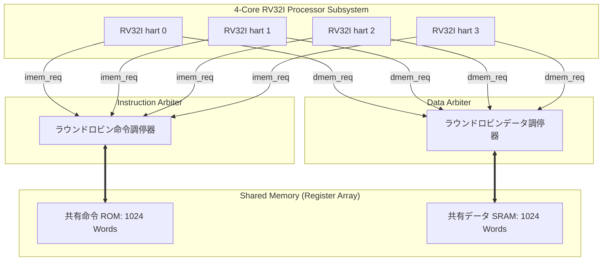

# 4コア共有メモリ マルチコア構成仕様書

## 1. 前提と採用アーキテクチャ

本アーキテクチャは、**4 hart（4コア）の共有メモリ SoC** である。
各 hart は独立した RV32I コア、PC、および 32 本の整数レジスタを持つ。
命令 ROM およびデータ SRAM はレジスタ配列で構成され、全 hart からのアクセス要求を独立したラウンドロビン調停器（仲裁器）で調停・直列化する。

各 hart のリセットベクタは `HART_RESET_VECTOR = h * HART_STRIDE_BYTES`（デフォルト stride 64バイト）により独立設定される。
また、SoC 外部から `hart_enable[3:0]` により各コアの起動を個別に制御可能である。

---

## 2. 要求・応答ポート契約 (Decoupled Request-Response Interface)

共有 SRAM の調停待ちや同期レイテンシを柔軟に扱うため、外部ポートは完全な要求・応答ハンドシェイク方式を採用している。

| ポート群 | 信号名 | 契約 |
| :--- | :--- | :--- |
| **命令** | `imem_req_valid`, `imem_req_ready`, `imem_req_addr`, `imem_rsp_valid`, `imem_rsp_inst`, `imem_rsp_error` | 受理された PC に対し、ちょうど 1 回応答を返却。応答まで PC を保持。 |
| **データ** | `dmem_req_valid`, `dmem_req_ready`, `dmem_req_addr`, `dmem_req_write`, `dmem_req_wdata`, `dmem_req_wstrb`, `dmem_rsp_valid`, `dmem_rsp_rdata`, `dmem_rsp_error` | 各要求を 1 回だけ受理し、結果またはエラーを返却。`wstrb` はリトルエンディアンのバイトレーン。 |
| **起動・識別** | `hart_enable`, `RESET_VECTOR` パラメータ | hart 固有の PC と起動状態を SoC 側から供給。調停器はポート番号で送信元を識別。 |

初版では各 hart の命令・データポートに **最大 1 件の未完了要求** だけを許可する。
調停器は受理した要求の送信元 Core ID を応答まで保持するため、複雑なトランザクション ID は不要である。
各コアは `FETCH_REQ`, `FETCH_WAIT`, `EXECUTE`, `MEM_REQ`, `MEM_WAIT`, `FAULTED` の状態を持ち、ストアの副作用、レジスタ書き込み、PC 更新を命令ごとに 1 回だけ行う。

---

## 3. メモリ順序と同期 (Memory Ordering & Synchronization)

- **メモリモデル**: 各 hart のメモリ操作を発行順に完了させ、共有 SRAM への操作をラウンドロビン調停器で直列化する。これは RISC-V RVWMO が要求する順序よりも強い順序付けを保証する。
- **FENCE 命令**: 現在の直列化メモリモデルでは順序矛盾が生じないため、**NOP** として安全に処理される。
- **マルチコア同期**: 共有メモリ上の特定のバイト／ワードを完了フラグとして用い、他 hart がそれをポーリング（スピンウェイト）することで、ハードウェアロックなしに確実なデータ交換と同期を実現できる（`tb_tiny_risc_4core.sv` で動作実証済み）。

---

## 4. 実装・検証ステータス

1. **要求・応答化単一コア**: `tb_tiny_risc` (1 hart 統合テスト) にて検証済み。
2. **2コア共有メモリ SoC**: `tb_tiny_risc_soc` にてバイトレーン共有書き込みおよび調停を検証済み。
3. **4コア統合検証**: `tb_tiny_risc_4core` にて 4 hart 同時実行、算術・即値・分岐・上位即値・FENCE・ロード/ストア、スピンロック同期、調停競合（261サイクル）の正常動作を完全検証済み。
4. **公式アーキテクチャテスト**: `test/riscv-tests/` にて公式 `riscv-tests` RV32UI 全 38 テストスイートの合格を検証済み。
