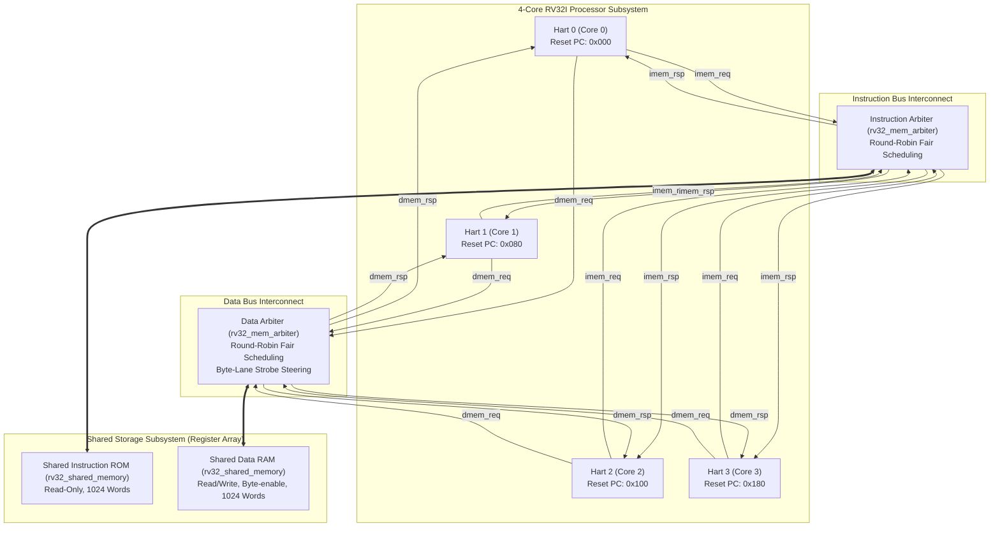
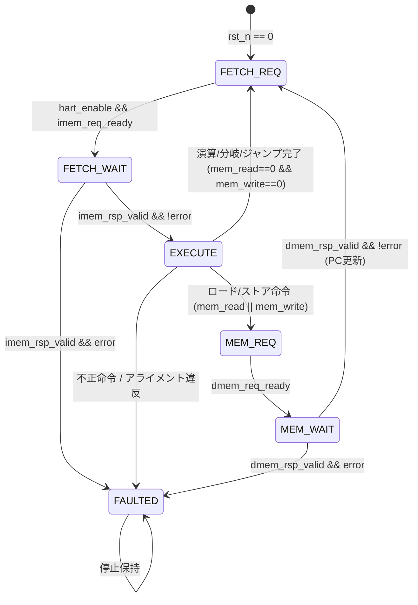

# tiny RISC-V 4-Core RV32I システム仕様書・設計仕様書

## 1. 概要 (Overview)

本プロジェクトは、32ビット RISC-V 基本整数命令セット（**RV32I** Base Integer Instruction Set, Version 2.1）に準拠したプロセッサコア `tiny_risc` と、そのコアを 4 基集積した共有メモリ型マルチコア SoC `tiny_risc_soc` の SystemVerilog 実装である。
シミュレーション容易性およびFPGA/ASICへの移植性を考慮し、命令 ROM およびデータ RAM は**レジスタ配列**（`logic [31:0] words [0:WORDS-1]`）で代用・実装されている。

---

## 2. CPU 機能仕様書 (CPU Functional Specification)

### 2.1 ISA 仕様
- **アーキテクチャ**: RISC-V RV32I (32-bit Base Integer Instruction Set, Version 2.1)
- **レジスタ長 (XLEN)**: 32 ビット
- **アドレス空間**: 32 ビットバイトアドレス空間（ワード整列アクセス）
- **エンディアン**: リトルエンディアン (Little-Endian)
- **汎用レジスタ**: 32本 ($x0 \sim x31$)
  - $x0$: 常に 0 にハードワイヤ（書き込みは無視）
  - $x1 \sim x31$: 汎用レジスタ（リセット時は全ビット 0）
- **プログラムカウンタ (PC)**: 32 ビット、リセットベクタはコアごとに設定可能（デフォルト: $CoreID \times 64$ または $CoreID \times 128$ バイト）

### 2.2 サポート命令セット一覧 (RV32I Complete Set)

| 分類 | 命令 | フォーマット | 動作内容 |
| :--- | :--- | :--- | :--- |
| **算術・論理演算 (R-Type)** | `ADD`, `SUB` | R-Type | $rd = rs1 \pm rs2$ |
| | `SLL`, `SRL`, `SRA` | R-Type | 論理左シフト、論理右シフト、算術右シフト |
| | `SLT`, `SLTU` | R-Type | 符号付き／符号なし比較 ($rs1 < rs2 \rightarrow 1 : 0$) |
| | `XOR`, `OR`, `AND` | R-Type | ビット毎論理排他的論理和、論理和、論理積 |
| **即値演算 (I-Type)** | `ADDI`, `SLTI`, `SLTIU` | I-Type | 符号拡張即値との加算・比較 |
| | `XORI`, `ORI`, `ANDI` | I-Type | 符号拡張即値とのビット毎論理演算 |
| | `SLLI`, `SRLI`, `SRAI` | I-Type | 即値シフト量 ($shamt = inst[24:20]$) によるシフト |
| **ロード命令 (I-Type)** | `LB`, `LBU` | I-Type | 符号付き／符号なしバイト読み出し (8-bit) |
| | `LH`, `LHU` | I-Type | 符号付き／符号なし半語読み出し (16-bit, 2バイト整列必須) |
| | `LW` | I-Type | 単語読み出し (32-bit, 4バイト整列必須) |
| **ストア命令 (S-Type)** | `SB`, `SH`, `SW` | S-Type | バイト(8-bit)、半語(16-bit)、単語(32-bit)書き込み |
| **条件分岐 (B-Type)** | `BEQ`, `BNE` | B-Type | 等値／非等値分岐 |
| | `BLT`, `BGE` | B-Type | 符号付き小なり／以上分岐 |
| | `BLTU`, `BGEU` | B-Type | 符号なし小なり／以上分岐 |
| **無条件ジャンプ** | `JAL` | J-Type | $rd = PC + 4; PC = PC + imm$ |
| | `JALR` | I-Type | $rd = PC + 4; PC = (rs1 + imm) \ \& \ \sim 1$ |
| **上位即値** | `LUI` | U-Type | $rd = imm[31:12] \ll 12$ |
| | `AUIPC` | U-Type | $rd = PC + (imm[31:12] \ll 12)$ |
| **メモリ同期** | `FENCE` | I-Type | 本構成ではインオーダー・共有バス直列化のため **NOP** として処理 |
| **システム** | `ECALL`, `EBREAK` | I-Type | 未実装トラップ／`fault` 状態へ安全に遷移 |

### 2.3 例外・フォルト処理仕様
以下の条件を検出した際、コアは即座に `fault` 信号を High にアサートし、後続命令の発行・レジスタ更新・メモリ書き込みを抑止して `FAULTED` 状態へ停止する。
1. **不正メモリアライメント**:
   - `LH`, `LHU`, `SH`: アドレス下位1ビットが非0 (`addr[0] != 0`)
   - `LW`, `SW`: アドレス下位2ビットが非0 (`addr[1:0] != 2'b00`)
2. **制御フローアライメント違反**:
   - 分岐成立時またはジャンプ先のターゲットPC下位2ビットが非0 (`next_pc[1:0] != 2'b00`)
3. **不正命令 (Illegal Instruction)**:
   - 未定義の opcode、またはサポート外のシステム命令 (`OPCODE_SYSTEM`) のフェッチ
4. **メモリ応答エラー**:
   - 共有メモリからの `imem_rsp_error` または `dmem_rsp_error` の受信

---

## 3. 全体アーキテクチャ設計仕様書 (SoC Architecture Specification)

### 3.1 4コア SoC 全体回路構成
SoCは4基の独立した `tiny_risc` コア (Hart 0 〜 Hart 3)、独立した命令調停器、データ調停器、およびレジスタ配列で構成された共有命令 ROM・共有データ RAM から構成される。

### 3.2 要求・応答ハンドシェイク方式 (Decoupled Request-Response Interface)
各コアと調停器・メモリ間は、サイクル遅延に柔軟に対応できるハンドシェイク方式を採用している。

| 信号名 | 方向 (Core視点) | 幅 | 説明 |
| :--- | :---: | :---: | :--- |
| `req_valid` | 出力 | 1 | アクセス要求が有効であることを示す |
| `req_ready` | 入力 | 1 | 接続先（調停器／メモリ）が要求を受理可能であることを示す |
| `req_addr`  | 出力 | 32 | バイトアドレス（ワード境界整列） |
| `req_write` | 出力 | 1 | 1: 書き込み要求, 0: 読み出し要求（命令側は常に 0） |
| `req_wdata` | 出力 | 32 | 書き込みデータ（バイトレーンに配置済み） |
| `req_wstrb` | 出力 | 4 | バイト毎書き込みイネーブル信号 |
| `rsp_valid` | 入力 | 1 | 応答データが有効であることを示す |
| `rsp_rdata` | 入力 | 32 | 読み出しデータ |
| `rsp_error` | 入力 | 1 | アクセスエラー通知（アドレス範囲外、アライメント不正など） |

- **契約 (Contract)**:
  - 要求は `req_valid && req_ready` が成立したクロックの立ち上がりで受理される。
  - 受理された要求に対して、後続サイクルで必ず 1 回だけ `rsp_valid` が返される（同一ポートのパイプライン要求は初版では 1 件に制限）。
  - 要求から応答までの間、PC および要求コンテキストは保持される。

### 3.3 コアのマルチサイクル・ステージ構成 (Core State Machine)
各コアは省面積・制御の確実性を重視した有限状態機械 (FSM) ベースのマルチサイクル構成をとる。

1. **`FETCH_REQ` (命令フェッチ要求)**:
   - `program_counter` をアドレスとして `imem_req_valid` をアサート。
   - `hart_enable` が High かつ調停器が `imem_req_ready` を返したら要求受理となり `FETCH_WAIT` へ遷移。
2. **`FETCH_WAIT` (命令フェッチ待機)**:
   - 共有 ROM からの `imem_rsp_valid` を待つ。
   - 命令データ `imem_rsp_inst` をラッチし、`EXECUTE` ステートへ遷移。
3. **`EXECUTE` (命令デコード & 実行)**:
   - デコーダ `control`、即値生成 `imm_gen`、レジスタ読み出し、ALU 演算を並行実行。
   - 演算命令・分岐命令・ジャンプ命令の場合：
     - レジスタ書き込みをコミットし、`next_pc` を計算して `program_counter` を更新。
     - 次の命令フェッチのため `FETCH_REQ` へ戻る（1命令完了）。
   - ロード／ストア命令の場合：
     - アライメント検査を実施（エラー時は `FAULTED` へ）。
     - 正常時は `MEM_REQ` へ遷移。
4. **`MEM_REQ` (データメモリアクセス要求)**:
   - ALU で計算されたメモリアドレス・ストアデータ・バイトストローブを出力。
   - `dmem_req_ready` が返れば `MEM_WAIT` へ遷移。
5. **`MEM_WAIT` (データメモリアクセス待機)**:
   - 共有 RAM からの `dmem_rsp_valid` を待つ。
   - ロード命令の場合、受信データから該当バイトレーンを抽出し符号拡張／ゼロ拡張してレジスタへ書き込み。
   - `program_counter` を更新して `FETCH_REQ` へ戻る。
6. **`FAULTED` (フォルト停止)**:
   - 不正命令・不正アライメント・メモリエラー発生時に遷移し、コア動作を安全に停止。

---

## 4. 各ブロックの設計仕様書 (Block Specifications)

### 4.1 `tiny_risc` (CPU コア)
- **ファイル**: `src/tiny_risc.sv`
- **機能**: 単一 hart の RV32I 実行コア。PC 管理、FSM 制御、データパス統合を担当。
- **主要ポート**:
  - `input logic clk, rst_n, hart_enable`: クロック、負論理リセット、コア起動イネーブル
  - `output logic fault`: コアフォルト停止出力
  - 命令メモリポート: `imem_req_*`, `imem_rsp_*`
  - データメモリポート: `dmem_req_*`, `dmem_rsp_*`
- **内部サブモジュール**:
  - `control`: 制御デコーダ
  - `regfile`: 32x32 汎用レジスタファイル
  - `alu`: 算術論理演算器
  - `imm_gen`: 即値生成器

### 4.2 `control` (命令デコーダ・制御ユニット)
- **ファイル**: `src/control.sv`
- **機能**: 32ビット命令の `opcode[6:0]`, `funct3[2:0]`, `funct7[6:0]` を完全組合せ回路でデコードし、データパス制御フラグおよび ALU コントロール信号を生成。
- **デコード出力**:
  - `reg_write`: レジスタ書き込みイネーブル
  - `alu_src`: ALU 第2オペランド選択 (0: rs2, 1: 即値)
  - `mem_to_reg[1:0]`: 書き戻しデータ選択 (00: ALU結果, 01: メモリ読み出し, 10: PC+4, 11: PC+即値)
  - `mem_write`: メモリ書き込み要求フラグ
  - `mem_read`: メモリ読み出し要求フラグ
  - `branch`: 条件分岐命令フラグ
  - `jump`: 無条件ジャンプ (JAL/JALR) フラグ
  - `alu_control[3:0]`: ALU 演算コード
  - `illegal_op`: 未定義命令・不正命令・未サポートシステム命令検出フラグ

### 4.3 `alu` (算術論理演算器)
- **ファイル**: `src/alu.sv`
- **機能**: 32ビットオペランド $A$ と $B$ に対する算術・論理・シフト・比較演算。
- **演算一覧**:
  - `ALU_ADD` (`4'h0`): $A + B$
  - `ALU_SUB` (`4'h1`): $A - B$
  - `ALU_AND` (`4'h2`): $A \ \& \ B$
  - `ALU_OR`  (`4'h3`): $A \mid B$
  - `ALU_XOR` (`4'h4`): $A \oplus B$
  - `ALU_SLL` (`4'h5`): $A \ll B[4:0]$ (論理左シフト)
  - `ALU_SRL` (`4'h6`): $A \gg B[4:0]$ (論理右シフト)
  - `ALU_SRA` (`4'h7`): $A \ggg B[4:0]$ (算術右シフト)
  - `ALU_SLT` (`4'h8`): $signed(A) < signed(B) \rightarrow 1 : 0$
  - `ALU_SLTU` (`4'h9`): $unsigned(A) < unsigned(B) \rightarrow 1 : 0$
  - `ALU_LUI` (`4'hA`): $B$ (オペランドBをそのまま出力)
- **比較出力**:
  - `zero`: $A == B$
  - `less_than`: 符号付き／符号なし比較結果

### 4.4 `imm_gen` (即値生成器)
- **ファイル**: `src/imm_gen.sv`
- **機能**: 命令フォーマットに応じたフィールド抽出と符号拡張。
  - **I型** (ADDI, Load, JALR): `{{20{inst[31]}}, inst[31:20]}`
  - **S型** (Store): `{{20{inst[31]}}, inst[31:25], inst[11:7]}`
  - **B型** (Branch): `{{19{inst[31]}}, inst[31], inst[7], inst[30:25], inst[11:8], 1'b0}`
  - **U型** (LUI, AUIPC): `{inst[31:12], 12'b0}`
  - **J型** (JAL): `{{11{inst[31]}}, inst[31], inst[19:12], inst[20], inst[30:21], 1'b0}`

### 4.5 `regfile` (レジスタファイル)
- **ファイル**: `src/regfile.sv`
- **機能**: 32ビット×32本の汎用レジスタファイル。
- **仕様**:
  - 非同期読み出しポート 2系統 (`data_rs1`, `data_rs2`)
  - 同期書き込みポート 1系統 (`we`, `addr_rd`, `write_data`)
  - アドレス `5'b00000` (x0) は常に `32'b0` を出力し、書き込みは自動的に無視。
  - リセット時 (`rst_n == 0`) に全レジスタをクリア。

### 4.6 `rv32_mem_arbiter` (共有メモリ調停器)
- **ファイル**: `src/rv32_mem_arbiter.sv`
- **機能**: $N$ 個の hart からのメモリアクセス要求を**ラウンドロビン方式**で公平に調停し、1つの共有メモリポートへ接続。
- **アルゴリズム**:
  - 前回のグラント位置 `last_grant` の次のインデックスから順次 `in_req_valid` をスキャン。
  - 受理した hart の ID (`owner`) をトランザクション完了（`out_rsp_valid` 到達）まで保持。
  - 共有メモリからの応答 `out_rsp_*` を `owner` のコアへルーティング。
  - スターベーション（特定のコアの飢餓状態）を完全に防止。

### 4.7 `rv32_shared_memory` (レジスタ配列共有メモリ ROM/RAM)
- **ファイル**: `src/rv32_shared_memory.sv`
- **機能**: SystemVerilog のレジスタ配列 (`logic [31:0] words [0:WORDS-1]`) による 32ビットワード SRAM/ROM モデル。
- **パラメータ**:
  - `WORDS`: ワード容量（デフォルト: 1024ワード = 4KiB）
  - `LATENCY`: メモリアクセス応答レイテンシ（サイクル数）
  - `READ_ONLY`: 1 のとき書き込みを禁止（ROM モード）
  - `INIT_FILE`: 初期化 HEX ファイルパス（省略時は 0 初期化）
- **バイトアクセスサポート**:
  - 4ビットの `req_wstrb` を用いて、該当するバイトレーン（8ビット単位）のみを選択的に書き込み更新。

### 4.8 `tiny_risc_soc` (4コア SoC トップレベル)
- **ファイル**: `src/tiny_risc_soc.sv`
- **パラメータ**:
  - `N_HARTS = 4`: 集積コア数（デフォルト: 4）
  - `HART_STRIDE_BYTES = 64`: 各コアのリセットベクタ間隔（バイト）
  - `IMEM_WORDS = 1024`: 共有命令 ROM 容量
  - `DMEM_WORDS = 1024`: 共有データ RAM 容量
  - `MEMORY_LATENCY = 1`: メモリレイテンシ

---

## 5. 検証仕様書および検証結果 (Verification Report)

### 5.1 テストスイート構成
| テストベンチ | 対象モジュール | 検証項目 | 結果 |
| :--- | :--- | :--- | :---: |
| `tb_control` | `control.sv` | 全命令デコード、FENCE NOP、SYSTEM fault、不正opcode検出 (34項目) | **PASS** |
| `tb_regfile` | `regfile.sv` | リセットクリア、書き込み、x0保護、同時読み書き (72項目) | **PASS** |
| `tb_tiny_risc` | `tiny_risc.sv` | 単一コア: 算術、AUIPC, JAL, BEQ, SB, LBU, メモリ待機 | **PASS** |
| `tb_tiny_risc_fault` | `tiny_risc.sv` | アライメント違反 (SH, JAL) 時の安全な `fault` 停止 | **PASS** |
| `tb_tiny_risc_soc` | `tiny_risc_soc.sv` | 2コア基本調停、バイト共有書き込み、調停競合 | **PASS** |
| `tb_tiny_risc_4core` | `tiny_risc_soc.sv` | **4コア完全統合検証**: 全RV32I命令並行実行、スピンロック同期、共有メモリ合成、調停競合 | **PASS** |

### 5.2 4コア統合テスト (`tb_tiny_risc_4core`) の検証結果詳細
- **動作シナリオ**:
  - **Hart 0**: R-Type 演算（ADD, SUB, SLL, SLT, XOR, OR, AND）を実行し、結果（`0x0D`）を共有メモリ Word 0 の Byte 0 に書き込み。
  - **Hart 1**: I-Type 演算（ADDI, SLLI, SRAI, XORI, ORI, ANDI, SLTIU）を実行し、結果（`0x1B`）を共有メモリ Word 0 の Byte 1 に書き込み。
  - **Hart 2**: B-Type 条件分岐（BEQ, BNE）を実行して正しい分岐経路を検証し、結果（`0x22`）を共有メモリ Word 0 の Byte 2 に書き込み。
  - **Hart 3**: LUI, AUIPC, FENCE を実行し、Byte 3 に `0x55` を書き込んだ後、他3コアの書き込み完了を**共有メモリポーリング（スピンウェイト）**で待機。全コア完了後に `LW` で Word 0 を一括ロード。
- **検証結果**:
  - 全4コアが目標PCへ正常到達（`hart_fault == 4'b0000`）。
  - 共有メモリ Word 0 の合成値が `0x55221B0D` と完全一致。
  - Hart 3 のロードレジスタ $x4$ が `0x55221B0D` と完全一致。
  - 4コア同時実行による命令調停競合サイクル数: **261 サイクル** を確認（ラウンドロビン調停の正常動作を実証）。

### 5.3 公式 RISC-V アーキテクチャテストスイート (riscv-tests RV32UI) による全命令適合性検証
RISC-V 国際標準の公式テストリポジトリ [`riscv-software-src/riscv-tests`](https://github.com/riscv-software-src/riscv-tests) の `rv32ui` スイート全 38 種を `tiny_risc` 向けにビルド・シミュレーション検証を実施。

- **実行スクリプト**: `test/riscv-tests/run_all_isa_tests.sh`
- **結果サマリー**: **38 / 38 テストスイート合格 (100% PASS, 0 FAIL)**

| カテゴリ | 対象テスト名 | 検証サイクル数 | 判定 |
| :--- | :--- | :---: | :---: |
| **算術演算 (R-Type)** | `add`, `sub` | 1836c, 1804c | **PASSED** |
| **論理演算 (R-Type)** | `and`, `or`, `xor` | 1916c, 1928c, 1924c | **PASSED** |
| **シフト演算 (R-Type)** | `sll`, `srl`, `sra` | 1948c, 2000c, 2024c | **PASSED** |
| **比較演算 (R-Type)** | `slt`, `sltu` | 1812c, 1812c | **PASSED** |
| **即値算術・論理 (I-Type)** | `addi`, `andi`, `ori`, `xori` | 944c, 768c, 796c, 804c | **PASSED** |
| **即値シフト (I-Type)** | `slli`, `srli`, `srai` | 940c, 976c, 1000c | **PASSED** |
| **即値比較 (I-Type)** | `slti`, `sltiu` | 924c, 924c | **PASSED** |
| **上位即値 / ジャンプ** | `lui`, `auipc`, `jal`, `jalr` | 236c, 212c, 196c, 436c | **PASSED** |
| **条件分岐 (B-Type)** | `beq`, `bne`, `blt`, `bge`, `bltu`, `bgeu` | 1140c 〜 1312c | **PASSED** |
| **ロード命令** | `lw`, `lh`, `lhu`, `lb`, `lbu` | 964c 〜 1084c | **PASSED** |
| **ストア命令** | `sw`, `sh`, `sb` | 1855c 〜 2096c | **PASSED** |
| **基本命令シーケンス** | `simple` | 140c | **PASSED** |

